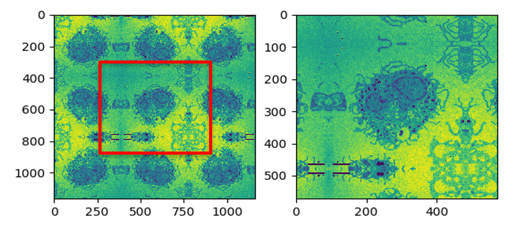
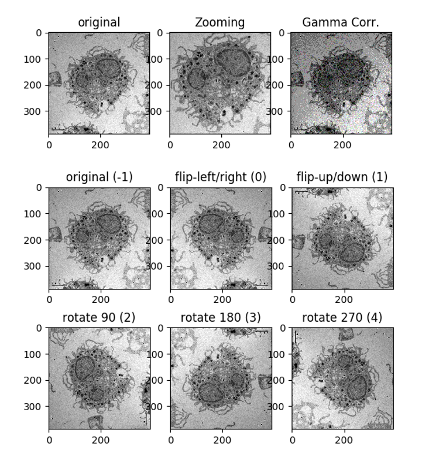
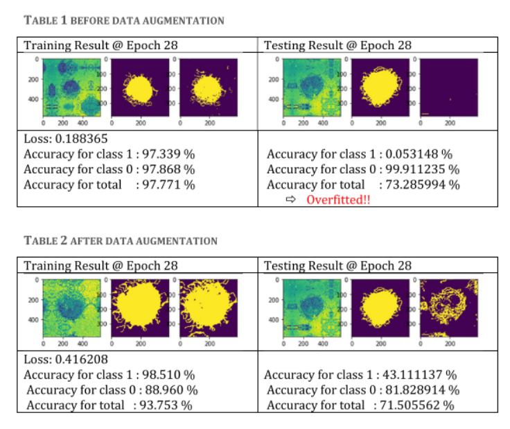
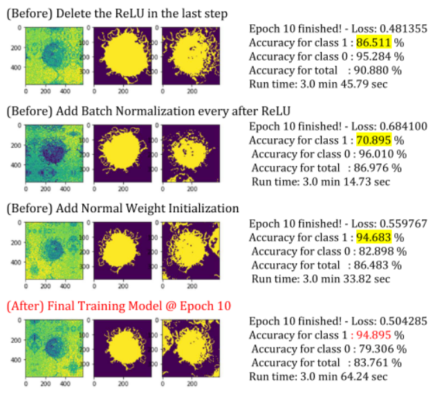

# Medical Image Segmentation - UNet
> Medical Image Segmentation with Deep Neural Network (U-Net) 

<!--[![NPM Version][npm-image]][npm-url] -->
<!--[![Build Status][travis-image]][travis-url] -->
<!--[![Downloads Stats][npm-downloads]][npm-url] -->

## Setup
```Matlab2018a```

## Input Data 
Rescaled the original data image from (1024, 1024) into (388, 388), and then applied mirroring to make (572, 572) 
-	Original Image Size: 1024 x 1024 
-	Data Image Size: 572 x 572 
-	Label Image Size: 388 x 388  


## Data Augmentation 
-	Random Zoom Images:  50% - 100% based on the center
-	Random Gamma Correction: gamma 0.5 - 1.5
-	Random Flip: Left-Right, Up-Down
-	Random Rotation: 0, 90, 180, 270



## Network Change 
The u-net model is customized as below. Based on my experiment, removing the ReLU at the last step and adding Batch normalization  seems working good for training stage, but initializing weights into normal distribution didn’t give any big differences. 

-	Delete the ReLU in the last step 
-	Add Batch Normalization every after ReLU
-	Add Normal Weight Initialization (Followed by the paper) 


# Results
-	Device: GPU
-	Epoch: 7 
-	Training Loss: 0.489522
-	Run time: 2 min 55 sec 

|--|Train (%)	|Test (%)|
|:--:|---:|---:|
|Accuracy for class 1 |	95.29	| 45.18|
|Accuracy for class 0 |	80.17	| 77.49|
|Accuracy for total	  | 85.10	| 68.88|


## Author

Suhong Kim – [@github](https://github.com/suhongkim) – suhongkim11@gmail.com \
Distributed under the MIT license. See the [LICENSE.md](LICENSE.md) file for details


## Inspiration
This project is a part of the CMPT743 assignments at SFU. Please check the website if you need. 
You can get more information on this assignment from 
[here](https://github.com/suhongkim/UNet-Image-Segmentation/blob/master/ref/Project%201%20-%20UNet.pdf)\
Also, you can start from the original framework
[here](https://drive.google.com/file/d/15eX5Hs_2BiZWb8DuVCX7EqMROtirhsqW/view)

